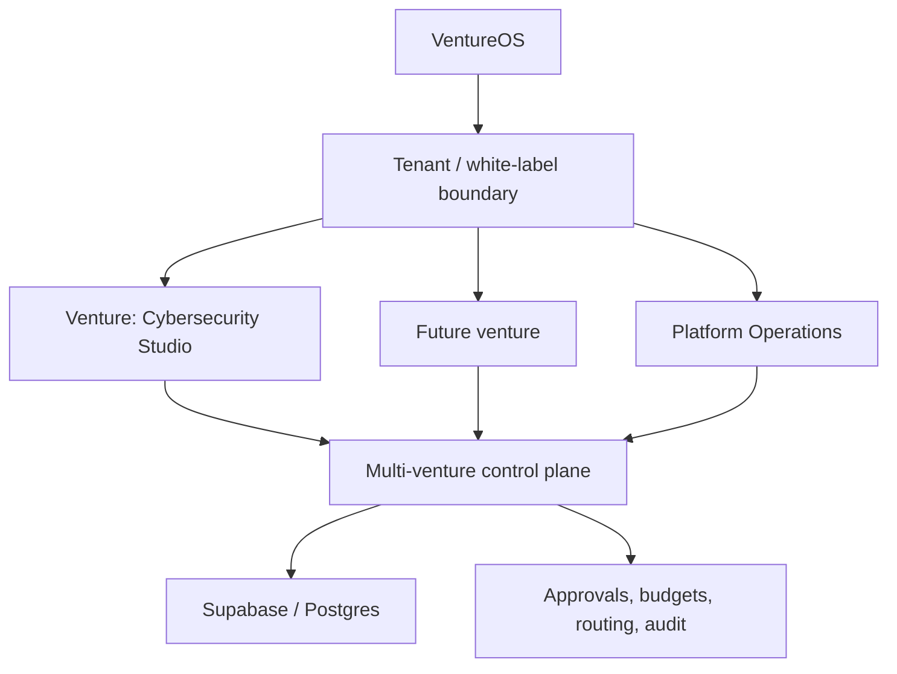

# VentureOS

A production-oriented **Agentic Venture Studio OS** for launching, operating,
and evaluating multiple agent-enabled businesses. The first proof venture is a
cybersecurity intelligence studio beginning with a recurring Account Signal
Intelligence service.

The first component is a provider-neutral **agent control plane**. It gives
Chief of Staff, Market Intelligence, Prospecting, Sales, Delivery, Customer
Success, Finance/Ops, Red Team/QA, and future workers one durable place to
coordinate without sharing chat history or database credentials directly.

## What v0.4 provides

- durable agent registry and capability metadata
- atomic work queue with ownership, leases, retries, and dead-letter handling
- agent-to-agent messages tied to work items
- versioned shared state and artifact references
- approval gates for consequential actions
- append-only audit events with latency and cost fields
- PostgreSQL/Supabase migration with private-by-default row-level security
- durable attempts, lease fencing, exact-payload approvals, and an action outbox
- versioned policies/tools plus kill switches, budgets, tracing, and eval records
- a deployed Supabase Edge gateway with custom, revocable agent authentication
- a portable FastAPI implementation with the same control-plane lifecycle
- organization and workspace isolation across businesses, clients, and internal
  operations
- workspace-scoped agents, queues, state, policies, budgets, approvals, and
  audit history
- explicit ventures beneath each tenant organization
- department and client workspaces within a venture
- multi-workspace agent membership without shared credentials
- versioned venture blueprints for repeatable proof ventures and white-label use
- tenant and venture brand-profile seams
- provider/model catalogs separated from durable agent identities
- task profiles, routing policies, candidate snapshots, and eval-linked choices
- venture budgets with pre-call cost reservation and actual-cost settlement

## Architecture



Agents never receive the Supabase service-role credential. They authenticate to
the control-plane API with individually revocable keys, and every meaningful
action is recorded.

## Repository layout

```text
control_plane_api/       FastAPI gateway and agent-key authentication
docs/
  architecture.md        system boundaries and authority model
  agent-protocol.md       job, message, approval, and heartbeat protocol
  control-plane-api.md    gateway setup and endpoint lifecycle
  edge-gateway.md         hosted Edge deployment and verification
  grok-bot-runtime.md     Grok Bot worker setup and shared-computer boundary
supabase/migrations/
  202609010001_control_plane.sql
  202609010002_frontier_hardening.sql
  20260902004613_add_workspace_isolation.sql
  20260902051157_add_venture_os_foundation.sql
supabase/functions/
  control-plane/          deployed Deno/TypeScript gateway adapter
supabase/tests/
  control_plane_smoke.sql
tests/                    FastAPI and credential unit tests
agent_runtime/            provider-neutral CLI for Grok Bot and other workers
```

## API quick start

```bash
cp .env.example .env
uv sync --group dev
uv run pytest -q
uv run uvicorn control_plane_api.main:app --reload
```

See [Control-Plane API](docs/control-plane-api.md) for the security boundary and
agent workflow.

## Hosted status

VentureOS v0.4 is live in the hosted `AI OS` Supabase development project. The
venture foundation and foreign-key index migrations are recorded, the
`control-plane` Edge Function is active as version 5 with custom agent
authentication, the complete SQL smoke suite passes, and the Supabase security
advisor reports zero findings. Outbound actions remain disabled.

The next milestone runs the first Account Signal Intelligence revenue workflow
through research, Red Team / QA, and commercial preparation.

See [VentureOS foundation](docs/venture-os.md),
[architecture](docs/architecture.md), the [agent protocol](docs/agent-protocol.md),
and the documented [frontier control-plane practices](docs/frontier-control-plane.md).
