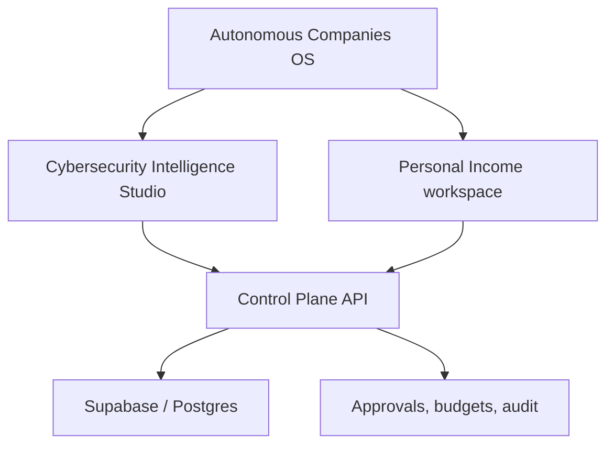

# Autonomous Companies OS

A production-oriented operating system for building and running agent-enabled
businesses. The first venture is the **Autonomous Cybersecurity Intelligence
Studio**, beginning with a recurring Account Signal Intelligence service.

The first component is a provider-neutral **agent control plane**. It gives
Chief of Staff, Market Intelligence, Prospecting, Sales, Delivery, Customer
Success, Finance/Ops, Red Team/QA, and future workers one durable place to
coordinate without sharing chat history or database credentials directly.

## What v0.3 provides

- durable agent registry and capability metadata
- atomic work queue with ownership, leases, retries, and dead-letter handling
- agent-to-agent messages tied to work items
- versioned shared state and artifact references
- approval gates for consequential actions
- append-only audit events with latency and cost fields
- PostgreSQL/Supabase migration with private-by-default row-level security
- durable attempts, lease fencing, exact-payload approvals, and an action outbox
- versioned policies/tools plus kill switches, budgets, tracing, and eval records
- a deployed Supabase Edge gateway with custom, revocable agent authentication
- a portable FastAPI implementation with the same control-plane lifecycle
- organization and workspace isolation across businesses, clients, and internal
  operations
- workspace-scoped agents, queues, state, policies, budgets, approvals, and
  audit history

## Architecture



Agents never receive the Supabase service-role credential. They authenticate to
the control-plane API with individually revocable keys, and every meaningful
action is recorded.

## Repository layout

```text
control_plane_api/       FastAPI gateway and agent-key authentication
docs/
  architecture.md        system boundaries and authority model
  agent-protocol.md       job, message, approval, and heartbeat protocol
  control-plane-api.md    gateway setup and endpoint lifecycle
  edge-gateway.md         hosted Edge deployment and verification
supabase/migrations/
  202609010001_control_plane.sql
  202609010002_frontier_hardening.sql
  20260902004613_add_workspace_isolation.sql
supabase/functions/
  control-plane/          deployed Deno/TypeScript gateway adapter
supabase/tests/
  control_plane_smoke.sql
tests/                    FastAPI and credential unit tests
```

## API quick start

```bash
cp .env.example .env
uv sync --group dev
uv run pytest -q
uv run uvicorn control_plane_api.main:app --reload
```

See [Control-Plane API](docs/control-plane-api.md) for the security boundary and
agent workflow.

## Hosted status

The v0.3 schema and `control-plane` Edge Function are deployed to the hosted
Supabase development project. Live verification covers workspace isolation,
public health, protected-route denial, and fail-closed administration. Outbound
actions remain disabled.

The next milestone bootstraps the company workspace, issues scoped keys to the
permanent business roster, and runs the first Account Signal Intelligence
revenue workflow. Job-search agents, if used, belong only in a separate
Personal Income workspace.

See [architecture](docs/architecture.md), the [agent protocol](docs/agent-protocol.md),
and the documented [frontier control-plane practices](docs/frontier-control-plane.md).
